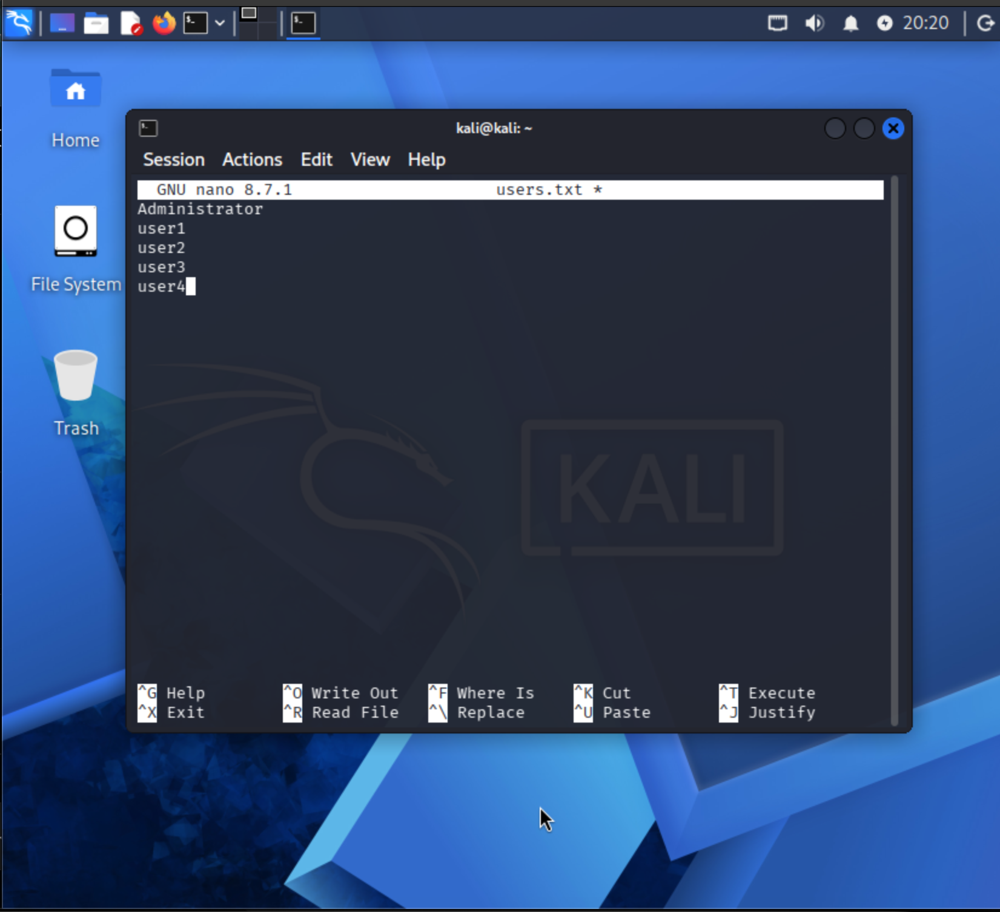
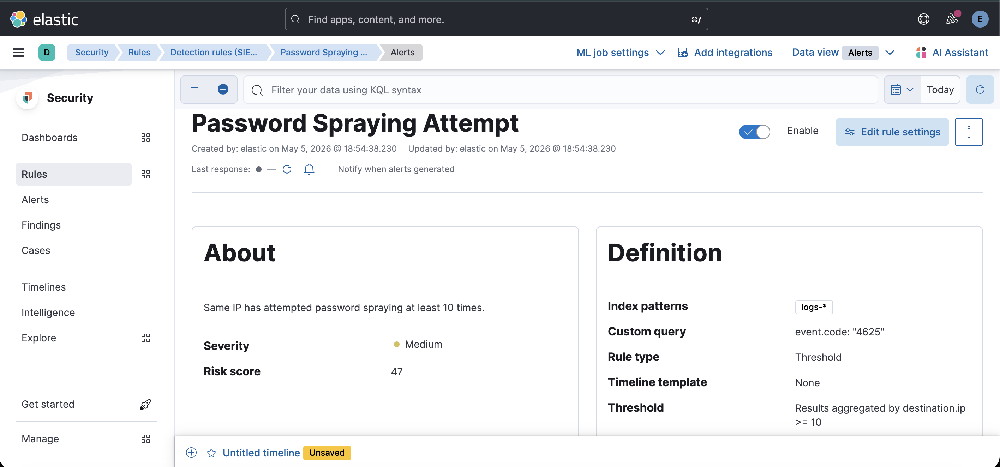
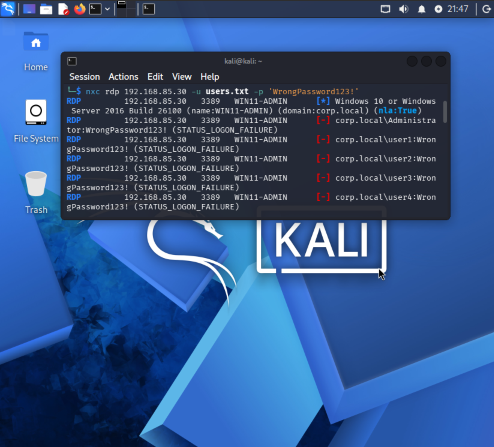
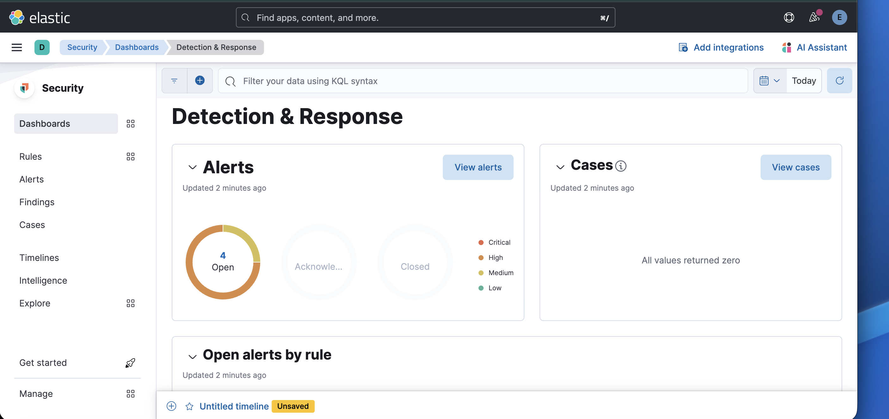

# 🚨 Password Spraying Detection

## 📌 Overview

Password spraying is a technique where an attacker attempts a single password across multiple user accounts to avoid account lockouts and detection.

---

## ⚔️ Attack Simulation

### Attacker Machine:

Kali Linux

### Tool Used:

NetExec (nxc)
#### File used for attack (executes multiple usernames of windows client)

## 🛡️ Detection Rule (Kibana)

### Attack Pattern:

* Same source IP
* Multiple usernames
* Same password
* Single attempt per user

---

## 🔍 Detection Logic

The rule identifies:

* A single source IP attempting logins
* Across multiple user accounts
* Within a short time window

This behavior is indicative of password spraying.

---

## 📸 Evidence

* Kali attack execution
* Kibana logs (Discover view)
* Alert generated in Security → Alerts

