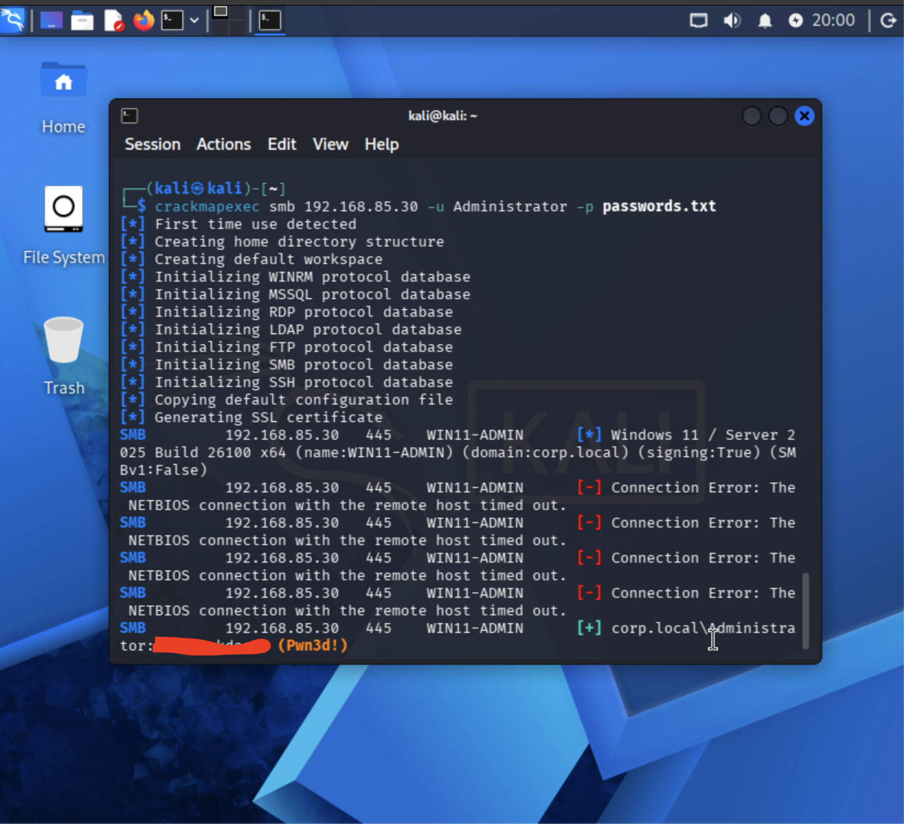
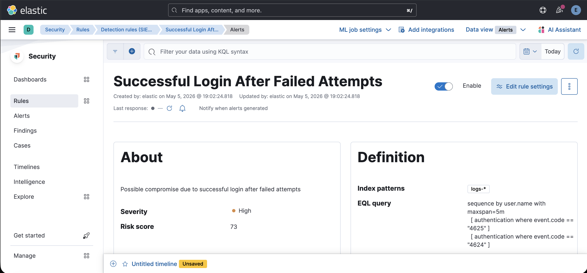
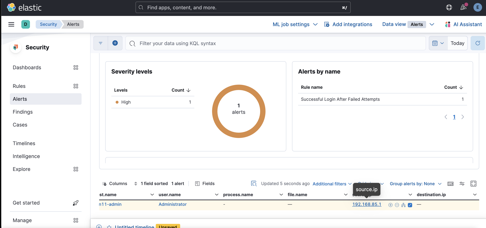

# 🔓 Successful Login After Failed Attempts Detection

## 📌 Overview

This detection identifies a potential account compromise where multiple failed login attempts are followed by a successful login.

---

## ⚔️ Attack Simulation

---

## 🛡️ Detection Rule (EQL)

---

## 🔍 Detection Logic

The rule detects:

* Multiple failed login attempts
* Followed by a successful login
* For the same user within a short time window

---

## 📸 Evidence

* Failed login attempts in Discover
* Successful login event
* Alert generated in Kibana

